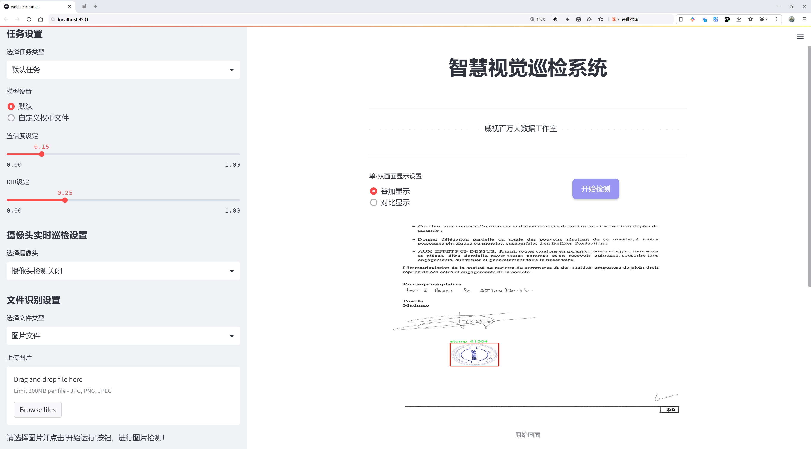
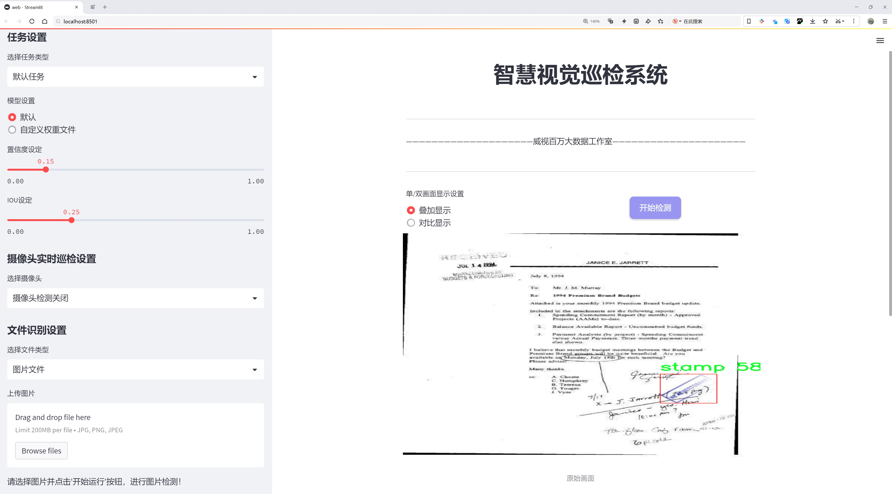
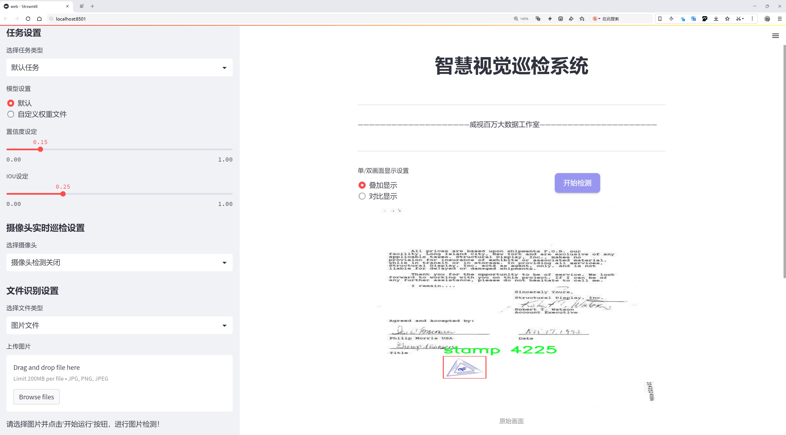
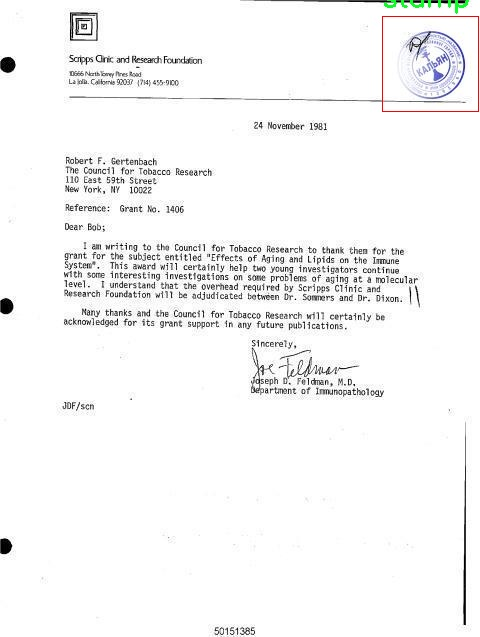
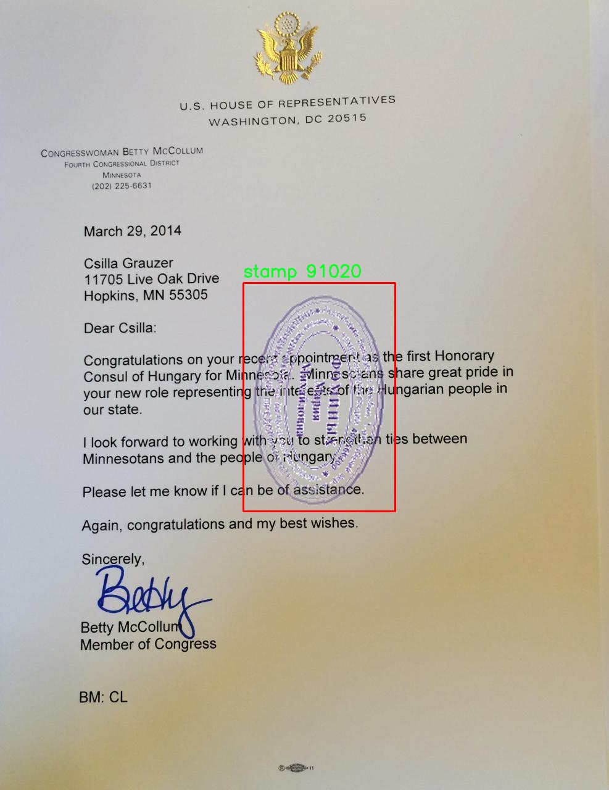
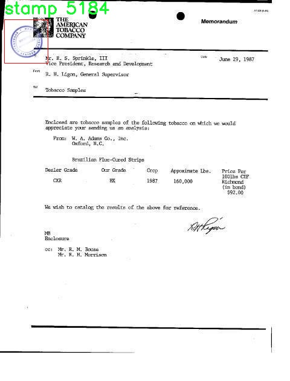

# 邮票盖章检测检测系统源码分享
 # [一条龙教学YOLOV8标注好的数据集一键训练_70+全套改进创新点发刊_Web前端展示]

### 1.研究背景与意义

项目参考[AAAI Association for the Advancement of Artificial Intelligence](https://gitee.com/qunmasj/projects)

项目来源[AACV Association for the Advancement of Computer Vision](https://kdocs.cn/l/cszuIiCKVNis)

研究背景与意义

随着信息技术的迅猛发展，自动化和智能化的需求在各个领域日益增强。邮票作为一种重要的邮政工具，不仅承载着邮件的运输功能，还蕴含着丰富的文化和历史价值。邮票的盖章过程是邮政服务中不可或缺的一环，然而，传统的人工盖章方式存在效率低、准确性差等问题，亟需借助现代技术进行改进。因此，基于改进YOLOv8的邮票盖章检测系统的研究具有重要的现实意义和应用前景。

YOLO（You Only Look Once）系列模型因其在实时目标检测任务中的高效性和准确性而受到广泛关注。YOLOv8作为该系列的最新版本，进一步提升了检测精度和速度，尤其适用于复杂背景下的小目标检测。邮票盖章检测系统的构建，旨在利用YOLOv8的优势，实现对邮票盖章状态的自动识别与分类，从而提高邮政处理的自动化水平，降低人工成本。

在本研究中，我们使用了一个名为“Obj_det_stamps”的数据集，该数据集包含2600张邮票图像，涵盖了邮票盖章的多种情况。尽管数据集的类别数量较少，仅有一个类别（邮票），但其图像数量的丰富性为模型的训练提供了良好的基础。通过对这些图像的深度学习训练，模型能够学习到邮票盖章的特征，从而在实际应用中实现高效的检测和识别。

此外，邮票盖章的自动检测不仅能够提高邮政服务的效率，还能在邮政行业的数字化转型中发挥重要作用。随着电子商务的快速发展，邮政快递业务的需求不断增加，传统的人工处理方式已无法满足现代化的服务要求。通过构建基于YOLOv8的邮票盖章检测系统，可以有效提升邮政处理的智能化水平，推动邮政行业的创新与发展。

在技术层面，本研究将探讨如何对YOLOv8模型进行改进，以适应邮票盖章检测的特定需求。我们将重点关注模型的训练策略、数据增强技术以及后处理方法，以期在保证检测精度的同时，提高模型的鲁棒性和实时性。这些技术的创新将为其他类似的目标检测任务提供借鉴，推动计算机视觉领域的发展。

综上所述，基于改进YOLOv8的邮票盖章检测系统的研究，不仅具有重要的学术价值，还具有广泛的应用前景。通过这一研究，我们希望能够为邮政行业的智能化转型提供切实可行的解决方案，同时为相关领域的研究者提供新的思路和方法。

### 2.图片演示







##### 注意：由于此博客编辑较早，上面“2.图片演示”和“3.视频演示”展示的系统图片或者视频可能为老版本，新版本在老版本的基础上升级如下：（实际效果以升级的新版本为准）

  （1）适配了YOLOV8的“目标检测”模型和“实例分割”模型，通过加载相应的权重（.pt）文件即可自适应加载模型。

  （2）支持“图片识别”、“视频识别”、“摄像头实时识别”三种识别模式。

  （3）支持“图片识别”、“视频识别”、“摄像头实时识别”三种识别结果保存导出，解决手动导出（容易卡顿出现爆内存）存在的问题，识别完自动保存结果并导出到tempDir中。

  （4）支持Web前端系统中的标题、背景图等自定义修改，后面提供修改教程。

  另外本项目提供训练的数据集和训练教程,暂不提供权重文件（best.pt）,需要您按照教程进行训练后实现图片演示和Web前端界面演示的效果。

### 3.视频演示

[3.1 视频演示](https://www.bilibili.com/video/BV11KtUe3E3i/)

### 4.数据集信息展示

##### 4.1 本项目数据集详细数据（类别数＆类别名）

nc: 1
names: ['stamp']


##### 4.2 本项目数据集信息介绍

数据集信息展示

在本研究中，我们使用了名为“Obj_det_stamps”的数据集，以支持对邮票盖章检测系统的训练和改进，特别是针对YOLOv8模型的优化。该数据集专注于邮票这一特定类别，具有明确的目标导向，旨在提高模型在邮票识别和检测任务中的准确性和效率。数据集的类别数量为1，类别列表中仅包含“stamp”这一项，显示出其专一性和针对性，这对于训练一个高效的检测系统至关重要。

“Obj_det_stamps”数据集的构建过程经过精心设计，确保了数据的多样性和代表性。邮票作为一个具有丰富文化和历史背景的物品，其外观和设计风格各异，涵盖了不同的颜色、形状和尺寸。这种多样性为模型的训练提供了丰富的样本，使其能够学习到邮票的各种特征和变异，进而提高检测的鲁棒性。数据集中包含的邮票图像经过精确标注，确保每个样本都能为模型提供清晰的目标信息，从而使得模型在训练过程中能够有效地学习到邮票的边界框和特征点。

在数据集的准备过程中，研究团队还考虑到了数据的平衡性和覆盖面。尽管“Obj_det_stamps”仅包含一个类别，但在邮票的样本选择上，团队努力涵盖了不同国家、不同年代和不同主题的邮票。这种策略不仅丰富了数据集的内容，也为模型提供了更广泛的学习基础，使其能够在实际应用中更好地适应各种邮票的检测需求。

为了确保数据集的高质量，所有图像均经过严格筛选，确保其清晰度和标注的准确性。此外，数据集还进行了适当的增强处理，包括旋转、缩放和颜色调整等，以提高模型的泛化能力。这些增强技术能够帮助模型在面对不同环境和条件下的邮票时，依然保持良好的检测性能。

在训练过程中，使用“Obj_det_stamps”数据集能够有效提升YOLOv8模型的检测精度和速度。YOLOv8作为一种先进的目标检测算法，具备快速处理和高效识别的特点，结合专门针对邮票设计的数据集，将进一步推动邮票盖章检测技术的发展。通过不断优化模型结构和训练策略，研究团队期望能够实现更高的检测准确率和更低的误检率，为邮票的自动化识别和处理提供强有力的技术支持。

总之，“Obj_det_stamps”数据集不仅为本研究提供了必要的基础数据，也为未来在邮票检测领域的进一步探索奠定了坚实的基础。通过对这一数据集的深入分析和应用，研究团队希望能够推动邮票检测技术的进步，促进相关领域的研究与发展。









### 5.全套项目环境部署视频教程（零基础手把手教学）

[5.1 环境部署教程链接（零基础手把手教学）](https://www.ixigua.com/7404473917358506534?logTag=c807d0cbc21c0ef59de5)


[5.2 安装Python虚拟环境创建和依赖库安装视频教程链接（零基础手把手教学）](https://www.ixigua.com/7404474678003106304?logTag=1f1041108cd1f708b01a)

### 6.手把手YOLOV8训练视频教程（零基础小白有手就能学会）

[6.1 手把手YOLOV8训练视频教程（零基础小白有手就能学会）](https://www.ixigua.com/7404477157818401292?logTag=d31a2dfd1983c9668658)

### 7.70+种全套YOLOV8创新点代码加载调参视频教程（一键加载写好的改进模型的配置文件）

[7.1 70+种全套YOLOV8创新点代码加载调参视频教程（一键加载写好的改进模型的配置文件）](https://www.ixigua.com/7404478314661806627?logTag=29066f8288e3f4eea3a4)

### 8.70+种全套YOLOV8创新点原理讲解（非科班也可以轻松写刊发刊，V10版本正在科研待更新）

由于篇幅限制，每个创新点的具体原理讲解就不一一展开，具体见下列网址中的创新点对应子项目的技术原理博客网址【Blog】：


[8.1 70+种全套YOLOV8创新点原理讲解链接](https://gitee.com/qunmasj/good)

### 9.系统功能展示（检测对象为举例，实际内容以本项目数据集为准）

图9.1.系统支持检测结果表格显示

  图9.2.系统支持置信度和IOU阈值手动调节

  图9.3.系统支持自定义加载权重文件best.pt(需要你通过步骤5中训练获得)

  图9.4.系统支持摄像头实时识别

  图9.5.系统支持图片识别

  图9.6.系统支持视频识别

  图9.7.系统支持识别结果文件自动保存

  图9.8.系统支持Excel导出检测结果数据


### 10.原始YOLOV8算法原理

原始YOLOv8算法原理

YOLOv8算法作为目标检测领域的一项重要进展，继承并优化了YOLO系列的核心思想，其设计目标是实现高效、准确且轻量化的目标检测。YOLOv8在YOLOv5的基础上进行了多方面的改进，特别是在网络结构和特征提取能力上，展现了更为出色的性能。该算法主要由三个部分构成：主干网络（Backbone）、特征融合网络（Neck）和检测头（Head），每个部分都经过精心设计，以确保在不同场景下的灵活应用。

在主干网络部分，YOLOv8采用了一系列卷积和反卷积层，以提取输入图像中的特征信息。与以往的YOLO版本不同，YOLOv8引入了C2F模块，这一模块不仅在轻量化方面表现优异，还通过增加残差连接来丰富梯度信息，从而提高了网络的训练效率和检测精度。C2F模块的设计灵感来源于YOLOv7中的ELAN模块，它结合了多种卷积结构的优点，使得特征提取更加高效。主干网络由多个CBS模块、C2F模块以及一个快速空间金字塔池化（SPPF）模块组成，这种组合有效地增强了网络对不同尺度特征的提取能力。

特征融合网络是YOLOv8的另一大亮点。该部分采用了多尺度特征融合技术，结合了特征金字塔网络（FPN）和路径聚合网络（PAN）的优势，旨在更好地捕捉不同尺度目标的信息。通过在特征融合网络中引入BiFPN结构，YOLOv8能够实现高效的双向跨尺度连接和加权特征融合。这种设计不仅提升了模型对不同尺度特征信息的提取速度，还增强了模型的鲁棒性，使其在复杂场景下的表现更加稳定。

在检测头部分，YOLOv8采用了当前流行的解耦合头结构，将目标分类和检测任务分离开来。这一设计使得模型在处理不同尺寸目标时能够更加灵活，且提高了检测的准确性。此外，YOLOv8摒弃了传统的锚框（Anchor-Based）方法，转而采用无锚框（Anchor-Free）检测策略，这一创新显著简化了模型的复杂性，并提升了检测效率。

YOLOv8在训练过程中也引入了一些新的策略以增强模型的性能。例如，在数据增强方面，YOLOv8借鉴了YOLOvX中的一些策略，特别是在训练的最后10个epoch中关闭马赛克增强，以避免对模型学习过程的干扰。同时，采用动态任务对齐分配策略（Task-Aligned Assigner）来优化样本分配，使得模型在训练时能够更好地适应不同类型的目标。

在损失计算方面，YOLOv8使用了BCELoss作为分类损失，而回归损失则结合了DFLLoss和CIoULoss。这种损失函数的设计旨在更好地平衡分类和回归任务之间的关系，从而提升模型的整体性能。

总的来说，YOLOv8算法在多个方面进行了创新和优化，使其在目标检测任务中表现出色。通过轻量化的设计和高效的特征提取能力，YOLOv8不仅能够满足实时检测的需求，还能在各种复杂场景中保持高准确率。随着YOLOv8的推出，目标检测技术在精度和效率上迈上了一个新的台阶，为相关应用的推广和发展提供了强有力的支持。未来，随着算法的不断优化和硬件性能的提升，YOLOv8有望在更广泛的领域中发挥其潜力，推动智能视觉技术的进一步发展。


### 11.项目核心源码讲解（再也不用担心看不懂代码逻辑）

#### 11.1 code\ultralytics\utils\downloads.py

以下是经过简化和注释的核心代码部分，主要包括文件下载、解压、检查磁盘空间等功能。注释详细解释了每个函数的作用和参数。

```python
import contextlib
import re
import shutil
import subprocess
from pathlib import Path
import requests
from zipfile import ZipFile, is_zipfile
from ultralytics.utils import LOGGER, TQDM

def is_url(url, check=True):
    """
    验证给定字符串是否为有效的URL，并可选地检查该URL是否在线。

    参数:
        url (str): 要验证的字符串。
        check (bool): 如果为True，则检查URL是否在线。

    返回:
        bool: 如果是有效的URL，则返回True；如果check为True，还会检查URL是否在线。
    """
    with contextlib.suppress(Exception):
        url = str(url)
        result = parse.urlparse(url)
        assert all([result.scheme, result.netloc])  # 检查是否为URL
        if check:
            with request.urlopen(url) as response:
                return response.getcode() == 200  # 检查是否在线
        return True
    return False

def delete_dsstore(path):
    """
    删除指定目录下的所有.DS_Store文件。

    参数:
        path (str): 要删除.DS_Store文件的目录路径。
    """
    matches = list(Path(path).rglob(".DS_Store"))
    LOGGER.info(f"Deleting .DS_Store files: {matches}")
    for f in matches:
        f.unlink()  # 删除文件

def zip_directory(directory):
    """
    将目录内容压缩为ZIP文件，排除.DS_Store文件。

    参数:
        directory (str | Path): 要压缩的目录路径。

    返回:
        Path: 生成的ZIP文件的路径。
    """
    delete_dsstore(directory)  # 删除.DS_Store文件
    directory = Path(directory)
    if not directory.is_dir():
        raise FileNotFoundError(f"Directory '{directory}' does not exist.")

    zip_file = directory.with_suffix(".zip")  # ZIP文件路径
    with ZipFile(zip_file, "w") as f:
        for file in TQDM(directory.rglob("*"), desc=f"Zipping {directory} to {zip_file}...", unit="file"):
            if file.is_file():
                f.write(file, file.relative_to(directory))  # 写入文件

    return zip_file  # 返回ZIP文件路径

def unzip_file(file, path=None):
    """
    解压缩ZIP文件到指定路径。

    参数:
        file (str): 要解压缩的ZIP文件路径。
        path (str, optional): 解压缩目标路径，默认为ZIP文件所在目录。

    返回:
        Path: 解压缩后的目录路径。
    """
    if not (Path(file).exists() and is_zipfile(file)):
        raise BadZipFile(f"File '{file}' does not exist or is not a valid zip file.")
    if path is None:
        path = Path(file).parent  # 默认路径

    with ZipFile(file) as zipObj:
        zipObj.extractall(path)  # 解压缩所有文件

    return path  # 返回解压缩目录

def check_disk_space(url="https://ultralytics.com/assets/coco128.zip", sf=1.5):
    """
    检查是否有足够的磁盘空间来下载和存储文件。

    参数:
        url (str): 文件的URL。
        sf (float): 安全因子，所需空间的乘数。

    返回:
        bool: 如果有足够的磁盘空间，则返回True；否则返回False。
    """
    try:
        r = requests.head(url)  # 获取响应头
        assert r.status_code < 400  # 检查响应状态
    except Exception:
        return True  # 请求问题，默认返回True

    data = int(r.headers.get("Content-Length", 0))  # 文件大小
    total, used, free = shutil.disk_usage(Path.cwd())  # 获取磁盘使用情况

    if data * sf < free:
        return True  # 有足够空间

    LOGGER.warning(f"WARNING ⚠️ Insufficient free disk space.")
    return False  # 空间不足

def safe_download(url, dir=None, unzip=True):
    """
    从URL下载文件，并可选择解压缩。

    参数:
        url (str): 要下载的文件的URL。
        dir (str, optional): 保存下载文件的目录。
        unzip (bool, optional): 是否解压缩下载的文件。

    返回:
        Path: 下载的文件路径。
    """
    f = Path(dir or ".") / url.split("/")[-1]  # 文件名
    if not f.is_file():  # 如果文件不存在
        LOGGER.info(f"Downloading {url} to '{f}'...")
        f.parent.mkdir(parents=True, exist_ok=True)  # 创建目录
        response = requests.get(url)  # 下载文件
        with open(f, "wb") as f_opened:
            f_opened.write(response.content)  # 写入文件

    if unzip and f.exists() and f.suffix in (".zip", ".tar", ".gz"):
        unzip_file(f)  # 解压缩文件

    return f  # 返回文件路径

def download(url, dir=Path.cwd(), unzip=True):
    """
    从指定URL下载文件到给定目录。

    参数:
        url (str | list): 要下载的文件的URL或URL列表。
        dir (Path, optional): 文件保存的目录，默认为当前工作目录。
        unzip (bool, optional): 是否解压缩下载的文件。

    示例:
        download('https://example.com/file.zip', dir='path/to/dir', unzip=True)
    """
    dir = Path(dir)
    dir.mkdir(parents=True, exist_ok=True)  # 创建目录
    safe_download(url, dir, unzip)  # 下载文件
```

### 主要功能
1. **URL验证**：`is_url`函数用于验证字符串是否为有效的URL。
2. **文件操作**：`delete_dsstore`、`zip_directory`和`unzip_file`函数用于处理文件的删除、压缩和解压缩。
3. **磁盘空间检查**：`check_disk_space`函数检查下载文件所需的磁盘空间是否足够。
4. **安全下载**：`safe_download`函数从指定URL下载文件，并可选择解压缩。
5. **下载管理**：`download`函数用于管理下载过程，包括创建目录和调用下载函数。

这些核心功能构成了文件下载和管理的基础，适用于各种应用场景。

这个文件 `downloads.py` 是 Ultralytics YOLO 项目中的一个工具模块，主要用于处理文件的下载、解压和相关的文件管理操作。以下是对文件中各个部分的详细说明。

首先，文件导入了一些必要的库，包括用于处理文件路径的 `Path`，用于网络请求的 `requests`，以及用于多线程处理的 `ThreadPool`。这些库为后续的功能实现提供了支持。

接下来，定义了一些与 GitHub 资源相关的常量，包括 `GITHUB_ASSETS_REPO` 和 `GITHUB_ASSETS_NAMES`，这些常量列出了 YOLO 系列模型的文件名。这些文件名用于后续的下载和管理操作。

`is_url` 函数用于验证给定字符串是否为有效的 URL，并可选择性地检查该 URL 是否在线。它使用 `urlparse` 来解析 URL，并通过 `urlopen` 检查其可用性。

`delete_dsstore` 函数用于删除指定目录下的 `.DS_Store` 文件，这些文件是 macOS 系统生成的隐藏文件，可能在不同操作系统之间传输文件时造成问题。

`zip_directory` 函数用于将指定目录的内容压缩为 ZIP 文件，支持排除特定文件，并可选择显示进度条。它首先调用 `delete_dsstore` 删除不必要的文件，然后使用 `ZipFile` 进行压缩。

`unzip_file` 函数用于解压 ZIP 文件，支持排除特定文件，并可选择是否覆盖已存在的内容。它会检查 ZIP 文件的结构，决定解压到哪个目录，并确保不会发生路径遍历的安全问题。

`check_disk_space` 函数用于检查是否有足够的磁盘空间来下载文件。它通过 HTTP 请求获取文件大小，并与当前磁盘的可用空间进行比较。

`get_google_drive_file_info` 函数用于从 Google Drive 的分享链接中提取直接下载链接和文件名，处理可能的下载配额超限问题。

`safe_download` 函数是一个通用的下载函数，支持从 URL 下载文件，并提供了重试机制、解压和删除下载文件的选项。它可以处理 Google Drive 链接，并根据需要调用其他辅助函数来完成下载。

`get_github_assets` 函数用于从指定的 GitHub 仓库获取版本标签和资产列表，支持重试机制以应对请求失败的情况。

`attempt_download_asset` 函数尝试从 GitHub 下载指定的文件，如果本地不存在该文件，则会从 GitHub 的发布版本中下载。

最后，`download` 函数用于从指定的 URL 下载文件，支持并发下载和多种选项，如解压、删除 ZIP 文件等。它使用 `ThreadPool` 来处理多个下载任务。

整体来看，这个模块提供了一系列实用的工具函数，方便用户在使用 Ultralytics YOLO 进行模型训练和推理时，能够高效地管理模型文件和数据集的下载与解压。

#### 11.2 70+种YOLOv8算法改进源码大全和调试加载训练教程（非必要）\ultralytics\trackers\utils\gmc.py

以下是经过简化并添加详细中文注释的核心代码部分：

```python
import cv2
import numpy as np
from ultralytics.utils import LOGGER

class GMC:
    """
    通用运动补偿 (GMC) 类，用于视频帧中的跟踪和物体检测。

    属性:
        method (str): 使用的跟踪方法，包括 'orb', 'sift', 'ecc', 'sparseOptFlow', 'none'。
        downscale (int): 用于处理的帧缩放因子。
        prevFrame (np.array): 存储用于跟踪的前一帧。
        prevKeyPoints (list): 存储前一帧的关键点。
        prevDescriptors (np.array): 存储前一帧的描述符。
        initializedFirstFrame (bool): 标志，指示是否已处理第一帧。
    """

    def __init__(self, method='sparseOptFlow', downscale=2):
        """初始化 GMC 对象，设置跟踪方法和缩放因子。"""
        self.method = method
        self.downscale = max(1, int(downscale))

        # 根据选择的方法初始化检测器、提取器和匹配器
        if self.method == 'orb':
            self.detector = cv2.FastFeatureDetector_create(20)
            self.extractor = cv2.ORB_create()
            self.matcher = cv2.BFMatcher(cv2.NORM_HAMMING)
        elif self.method == 'sift':
            self.detector = cv2.SIFT_create()
            self.extractor = cv2.SIFT_create()
            self.matcher = cv2.BFMatcher(cv2.NORM_L2)
        elif self.method == 'ecc':
            self.warp_mode = cv2.MOTION_EUCLIDEAN
            self.criteria = (cv2.TERM_CRITERIA_EPS | cv2.TERM_CRITERIA_COUNT, 5000, 1e-6)
        elif self.method == 'sparseOptFlow':
            self.feature_params = dict(maxCorners=1000, qualityLevel=0.01, minDistance=1, blockSize=3)
        elif self.method in ['none', 'None', None]:
            self.method = None
        else:
            raise ValueError(f'错误: 未知的 GMC 方法: {method}')

        # 初始化状态
        self.prevFrame = None
        self.prevKeyPoints = None
        self.prevDescriptors = None
        self.initializedFirstFrame = False

    def apply(self, raw_frame, detections=None):
        """根据指定的方法对原始帧应用物体检测。"""
        if self.method in ['orb', 'sift']:
            return self.applyFeatures(raw_frame, detections)
        elif self.method == 'ecc':
            return self.applyEcc(raw_frame, detections)
        elif self.method == 'sparseOptFlow':
            return self.applySparseOptFlow(raw_frame, detections)
        else:
            return np.eye(2, 3)  # 返回单位矩阵

    def applyEcc(self, raw_frame, detections=None):
        """应用 ECC 算法进行运动补偿。"""
        height, width, _ = raw_frame.shape
        frame = cv2.cvtColor(raw_frame, cv2.COLOR_BGR2GRAY)  # 转换为灰度图
        H = np.eye(2, 3, dtype=np.float32)  # 初始化变换矩阵

        # 根据缩放因子缩小图像
        if self.downscale > 1.0:
            frame = cv2.resize(frame, (width // self.downscale, height // self.downscale))

        # 处理第一帧
        if not self.initializedFirstFrame:
            self.prevFrame = frame.copy()  # 复制当前帧
            self.initializedFirstFrame = True  # 标记第一帧已初始化
            return H

        # 运行 ECC 算法
        try:
            (cc, H) = cv2.findTransformECC(self.prevFrame, frame, H, self.warp_mode, self.criteria)
        except Exception as e:
            LOGGER.warning(f'警告: 变换失败，使用单位矩阵 {e}')

        return H

    def applyFeatures(self, raw_frame, detections=None):
        """应用特征检测方法（如 ORB 或 SIFT）。"""
        height, width, _ = raw_frame.shape
        frame = cv2.cvtColor(raw_frame, cv2.COLOR_BGR2GRAY)  # 转换为灰度图
        H = np.eye(2, 3)

        # 根据缩放因子缩小图像
        if self.downscale > 1.0:
            frame = cv2.resize(frame, (width // self.downscale, height // self.downscale))

        # 检测关键点
        keypoints = self.detector.detect(frame)

        # 处理第一帧
        if not self.initializedFirstFrame:
            self.prevFrame = frame.copy()
            self.prevKeyPoints = copy.copy(keypoints)
            self.initializedFirstFrame = True
            return H

        # 匹配描述符
        knnMatches = self.matcher.knnMatch(self.prevDescriptors, descriptors, 2)
        matches = [m for m, n in knnMatches if m.distance < 0.9 * n.distance]

        # 找到刚性变换矩阵
        if len(matches) > 4:
            prevPoints = np.array([self.prevKeyPoints[m.queryIdx].pt for m in matches])
            currPoints = np.array([keypoints[m.trainIdx].pt for m in matches])
            H, inliers = cv2.estimateAffinePartial2D(prevPoints, currPoints, cv2.RANSAC)

            # 处理缩放
            if self.downscale > 1.0:
                H[0, 2] *= self.downscale
                H[1, 2] *= self.downscale
        else:
            LOGGER.warning('警告: 匹配点不足')

        # 更新状态
        self.prevFrame = frame.copy()
        self.prevKeyPoints = copy.copy(keypoints)

        return H

    def applySparseOptFlow(self, raw_frame, detections=None):
        """应用稀疏光流法进行运动补偿。"""
        height, width, _ = raw_frame.shape
        frame = cv2.cvtColor(raw_frame, cv2.COLOR_BGR2GRAY)
        H = np.eye(2, 3)

        # 根据缩放因子缩小图像
        if self.downscale > 1.0:
            frame = cv2.resize(frame, (width // self.downscale, height // self.downscale))

        # 检测关键点
        keypoints = cv2.goodFeaturesToTrack(frame, mask=None, **self.feature_params)

        # 处理第一帧
        if not self.initializedFirstFrame:
            self.prevFrame = frame.copy()
            self.prevKeyPoints = copy.copy(keypoints)
            self.initializedFirstFrame = True
            return H

        # 计算光流
        matchedKeypoints, status, err = cv2.calcOpticalFlowPyrLK(self.prevFrame, frame, self.prevKeyPoints, None)

        # 留下好的匹配点
        prevPoints = [self.prevKeyPoints[i] for i in range(len(status)) if status[i]]
        currPoints = [matchedKeypoints[i] for i in range(len(status)) if status[i]]

        # 找到刚性变换矩阵
        if len(prevPoints) > 4:
            H, inliers = cv2.estimateAffinePartial2D(np.array(prevPoints), np.array(currPoints), cv2.RANSAC)

            # 处理缩放
            if self.downscale > 1.0:
                H[0, 2] *= self.downscale
                H[1, 2] *= self.downscale
        else:
            LOGGER.warning('警告: 匹配点不足')

        # 更新状态
        self.prevFrame = frame.copy()
        self.prevKeyPoints = copy.copy(keypoints)

        return H
```

### 代码说明：
1. **类 GMC**：实现了通用运动补偿的功能，支持多种跟踪算法。
2. **初始化方法**：根据用户选择的跟踪方法初始化相关的检测器、提取器和匹配器。
3. **apply 方法**：根据当前选择的跟踪方法调用相应的处理函数。
4. **applyEcc 方法**：实现了基于 ECC 的运动补偿算法。
5. **applyFeatures 方法**：实现了基于特征的跟踪（如 ORB 和 SIFT）。
6. **applySparseOptFlow 方法**：实现了稀疏光流法的运动补偿。

每个方法中都包含了对图像的预处理、关键点的检测、描述符的匹配以及运动补偿矩阵的计算。

这个程序文件定义了一个名为 `GMC` 的类，主要用于视频帧中的目标跟踪和检测。它实现了多种跟踪算法，包括 ORB、SIFT、ECC 和稀疏光流（Sparse Optical Flow），并支持对帧进行下采样以提高计算效率。

在类的初始化方法 `__init__` 中，用户可以指定所使用的跟踪方法和下采样因子。根据选择的跟踪方法，程序会初始化相应的特征检测器、描述符提取器和匹配器。例如，如果选择 ORB 方法，程序会创建一个 ORB 特征提取器和一个基于汉明距离的匹配器；如果选择 SIFT 方法，则会使用 SIFT 特征提取器和基于欧几里得距离的匹配器；而对于 ECC 方法，则会设置相应的迭代次数和终止条件。

类中有多个方法，其中 `apply` 方法是主入口，用于根据指定的方法处理输入的原始帧。它会调用不同的处理方法，如 `applyEcc`、`applyFeatures` 或 `applySparseOptFlow`，具体取决于所选的跟踪方法。

`applyEcc` 方法实现了基于增强相关性（ECC）的跟踪。它首先将输入帧转换为灰度图像，并根据下采样因子对图像进行处理。对于第一帧，它会初始化必要的数据结构。对于后续帧，程序会使用 `cv2.findTransformECC` 函数计算当前帧与前一帧之间的变换矩阵。

`applyFeatures` 方法则使用特征点匹配来跟踪目标。它会检测关键点并计算描述符，然后通过 KNN 匹配找到前一帧和当前帧之间的匹配点。程序会过滤掉不合适的匹配，并使用 RANSAC 算法估计刚性变换矩阵。

`applySparseOptFlow` 方法实现了稀疏光流跟踪。它会使用 `cv2.goodFeaturesToTrack` 函数找到关键点，并通过 `cv2.calcOpticalFlowPyrLK` 计算前一帧和当前帧之间的光流。与前面的两个方法类似，程序会在找到足够的匹配点后估计变换矩阵。

总的来说，这个类提供了一种灵活的方式来实现视频中的目标跟踪，用户可以根据需求选择不同的跟踪算法，并通过下采样来提高处理效率。

#### 11.3 ui.py

以下是保留的核心代码部分，并附上详细的中文注释：

```python
import sys
import subprocess

def run_script(script_path):
    """
    使用当前 Python 环境运行指定的脚本。

    Args:
        script_path (str): 要运行的脚本路径

    Returns:
        None
    """
    # 获取当前 Python 解释器的路径
    python_path = sys.executable

    # 构建运行命令，使用 streamlit 运行指定的脚本
    command = f'"{python_path}" -m streamlit run "{script_path}"'

    # 执行命令，并等待其完成
    result = subprocess.run(command, shell=True)
    
    # 检查命令执行的返回码，如果不为0则表示出错
    if result.returncode != 0:
        print("脚本运行出错。")

# 实例化并运行应用
if __name__ == "__main__":
    # 指定要运行的脚本路径
    script_path = "web.py"  # 假设脚本在当前目录下

    # 调用函数运行脚本
    run_script(script_path)
```

### 注释说明：
1. **导入模块**：
   - `sys`：用于获取当前 Python 解释器的路径。
   - `subprocess`：用于执行外部命令。

2. **`run_script` 函数**：
   - 接受一个参数 `script_path`，表示要运行的 Python 脚本的路径。
   - 使用 `sys.executable` 获取当前 Python 解释器的路径，以确保使用相同的环境来运行脚本。
   - 构建一个命令字符串，使用 `streamlit` 模块来运行指定的脚本。
   - 使用 `subprocess.run` 执行命令，并通过 `shell=True` 允许在 shell 中执行命令。
   - 检查命令的返回码，如果返回码不为0，表示脚本运行出错，打印错误信息。

3. **主程序块**：
   - 通过 `if __name__ == "__main__":` 确保只有在直接运行该脚本时才会执行以下代码。
   - 指定要运行的脚本路径（这里假设脚本在当前目录下）。
   - 调用 `run_script` 函数来执行指定的脚本。

这个程序文件名为 `ui.py`，其主要功能是使用当前的 Python 环境来运行一个指定的脚本，具体是一个名为 `web.py` 的文件。程序首先导入了必要的模块，包括 `sys`、`os` 和 `subprocess`，这些模块分别用于访问系统参数、操作系统功能和执行外部命令。

在 `run_script` 函数中，首先获取当前 Python 解释器的路径，这样可以确保在正确的环境中运行脚本。接着，构建一个命令字符串，该命令使用 `streamlit` 模块来运行指定的脚本。`streamlit` 是一个用于构建数据应用的库，命令的格式是 `python -m streamlit run "script_path"`。

然后，使用 `subprocess.run` 方法执行这个命令。该方法会在一个新的进程中运行命令，并等待其完成。如果命令执行的返回码不为零，表示脚本运行出错，程序会输出一条错误信息。

在文件的最后部分，使用 `if __name__ == "__main__":` 语句来确保只有在直接运行该文件时才会执行下面的代码。此处指定了要运行的脚本路径 `web.py`，并调用 `run_script` 函数来执行它。

整体来看，这个程序的设计旨在简化在特定 Python 环境中运行 `streamlit` 应用的过程。

#### 11.4 70+种YOLOv8算法改进源码大全和调试加载训练教程（非必要）\ultralytics\models\fastsam\prompt.py

以下是代码中最核心的部分，并附上详细的中文注释：

```python
import os
import numpy as np
import torch
from PIL import Image
import cv2
from ultralytics.utils import TQDM

class FastSAMPrompt:
    """
    Fast Segment Anything Model类，用于图像注释和可视化。

    属性:
        device (str): 计算设备（'cuda'或'cpu'）。
        results: 目标检测或分割结果。
        source: 源图像或图像路径。
        clip: 用于线性分配的CLIP模型。
    """

    def __init__(self, source, results, device='cuda') -> None:
        """初始化FastSAMPrompt，设置源图像、结果和设备，并导入CLIP模型。"""
        self.device = device
        self.results = results
        self.source = source

        # 导入并分配CLIP模型
        try:
            import clip  # 用于线性分配
        except ImportError:
            from ultralytics.utils.checks import check_requirements
            check_requirements('git+https://github.com/openai/CLIP.git')
            import clip
        self.clip = clip

    @staticmethod
    def _format_results(result, filter=0):
        """将检测结果格式化为包含ID、分割、边界框、分数和面积的注释列表。"""
        annotations = []
        n = len(result.masks.data) if result.masks is not None else 0
        for i in range(n):
            mask = result.masks.data[i] == 1.0
            if torch.sum(mask) >= filter:
                annotation = {
                    'id': i,
                    'segmentation': mask.cpu().numpy(),
                    'bbox': result.boxes.data[i],
                    'score': result.boxes.conf[i]}
                annotation['area'] = annotation['segmentation'].sum()
                annotations.append(annotation)
        return annotations

    def plot(self, annotations, output):
        """
        在图像上绘制注释、边界框和点，并保存输出。

        参数:
            annotations (list): 要绘制的注释。
            output (str or Path): 保存绘图的输出目录。
        """
        pbar = TQDM(annotations, total=len(annotations))
        for ann in pbar:
            result_name = os.path.basename(ann.path)
            image = ann.orig_img[..., ::-1]  # BGR转RGB
            plt.figure(figsize=(original_w / 100, original_h / 100))
            plt.imshow(image)

            if ann.masks is not None:
                masks = ann.masks.data
                # 在这里可以对mask进行处理，例如形态学变换等
                self.fast_show_mask(masks, plt.gca())

            # 保存图像
            save_path = Path(output) / result_name
            plt.axis('off')
            plt.savefig(save_path, bbox_inches='tight', pad_inches=0, transparent=True)
            plt.close()
            pbar.set_description(f'Saving {result_name} to {save_path}')

    @staticmethod
    def fast_show_mask(annotation, ax):
        """
        快速在给定的matplotlib轴上显示mask注释。

        参数:
            annotation (array-like): mask注释。
            ax (matplotlib.axes.Axes): matplotlib轴。
        """
        n, h, w = annotation.shape  # batch, height, width
        areas = np.sum(annotation, axis=(1, 2))
        annotation = annotation[np.argsort(areas)]

        # 创建透明度和颜色
        color = np.random.random((n, 1, 1, 3))
        transparency = np.ones((n, 1, 1, 1)) * 0.6
        visual = np.concatenate([color, transparency], axis=-1)
        mask_image = np.expand_dims(annotation, -1) * visual

        show = np.zeros((h, w, 4))
        ax.imshow(show)

    @torch.no_grad()
    def retrieve(self, model, preprocess, elements, search_text: str, device) -> int:
        """处理图像和文本，计算相似度，并返回softmax分数。"""
        preprocessed_images = [preprocess(image).to(device) for image in elements]
        tokenized_text = self.clip.tokenize([search_text]).to(device)
        stacked_images = torch.stack(preprocessed_images)
        image_features = model.encode_image(stacked_images)
        text_features = model.encode_text(tokenized_text)
        image_features /= image_features.norm(dim=-1, keepdim=True)
        text_features /= text_features.norm(dim=-1, keepdim=True)
        probs = 100.0 * image_features @ text_features.T
        return probs[:, 0].softmax(dim=0)

    def everything_prompt(self):
        """返回处理后的结果。"""
        return self.results
```

### 代码核心部分解释：

1. **类定义与初始化**：
   - `FastSAMPrompt`类用于处理图像分割和注释。初始化时接收源图像、检测结果和计算设备，并导入CLIP模型。

2. **结果格式化**：
   - `_format_results`方法将检测结果转换为包含必要信息的注释列表，便于后续处理。

3. **绘图与可视化**：
   - `plot`方法用于在图像上绘制分割结果和边界框，并将结果保存到指定路径。

4. **快速显示Mask**：
   - `fast_show_mask`方法在给定的matplotlib轴上快速显示分割mask，支持随机颜色和透明度设置。

5. **检索相似度**：
   - `retrieve`方法处理图像和文本，计算它们之间的相似度，并返回softmax分数，便于后续选择最相关的结果。

6. **获取最终结果**：
   - `everything_prompt`方法返回处理后的结果，供外部调用。

这些核心部分构成了图像分割和注释的基础功能，能够实现快速的图像处理和可视化。

这个程序文件是一个用于图像注释和可视化的类，名为 `FastSAMPrompt`，它是基于 Ultralytics YOLO 的 Fast Segment Anything Model。该类的主要功能是处理图像的分割和注释，支持通过边界框、点、文本等多种方式进行交互式的图像处理。

在初始化方法 `__init__` 中，类接受三个参数：源图像、检测结果和计算设备（默认为 CUDA）。它还尝试导入 CLIP 模型以进行线性分配，如果未安装则会检查并安装相关依赖。

类中有多个静态方法和实例方法。 `_segment_image` 方法根据给定的边界框坐标对图像进行分割，返回一个包含分割结果的图像。 `_format_results` 方法将检测结果格式化为包含 ID、分割、边界框、置信度和面积的注释列表。 `_get_bbox_from_mask` 方法通过对掩膜应用形态学变换来获取边界框。

`plot` 方法用于在图像上绘制注释、边界框和点，并将结果保存到指定的输出目录。它使用 `matplotlib` 来显示图像，并支持多种参数配置，如是否使用随机颜色、是否应用形态学变换等。

`fast_show_mask` 方法快速显示掩膜注释，支持在指定的 `matplotlib` 轴上绘制掩膜。`retrieve` 方法处理图像和文本，计算相似度并返回 softmax 分数。

`_crop_image` 方法根据提供的注释格式裁剪图像，并返回裁剪后的图像和相关数据。`box_prompt` 方法修改边界框属性并计算掩膜与边界框之间的交并比（IoU）。`point_prompt` 方法根据用户输入调整检测到的掩膜上的点，并返回修改后的结果。`text_prompt` 方法处理文本提示，应用于现有结果并返回更新后的结果。

最后，`everything_prompt` 方法返回类中处理后的结果。这些方法结合在一起，使得该类能够灵活地处理图像分割任务，支持多种交互方式，适用于需要精确图像注释的应用场景。

#### 11.5 train.py

以下是代码中最核心的部分，并附上详细的中文注释：

```python
class DetectionTrainer(BaseTrainer):
    """
    DetectionTrainer类用于基于检测模型进行训练，继承自BaseTrainer类。
    """

    def build_dataset(self, img_path, mode="train", batch=None):
        """
        构建YOLO数据集。

        参数:
            img_path (str): 包含图像的文件夹路径。
            mode (str): 模式，`train`表示训练模式，`val`表示验证模式，用户可以为每种模式自定义不同的数据增强。
            batch (int, optional): 批次大小，仅用于`rect`模式。默认为None。
        """
        gs = max(int(de_parallel(self.model).stride.max() if self.model else 0), 32)  # 获取模型的最大步幅
        return build_yolo_dataset(self.args, img_path, batch, self.data, mode=mode, rect=mode == "val", stride=gs)

    def get_dataloader(self, dataset_path, batch_size=16, rank=0, mode="train"):
        """构造并返回数据加载器。"""
        assert mode in ["train", "val"]  # 确保模式为训练或验证
        with torch_distributed_zero_first(rank):  # 在分布式训练中，仅初始化一次数据集
            dataset = self.build_dataset(dataset_path, mode, batch_size)  # 构建数据集
        shuffle = mode == "train"  # 训练模式下打乱数据
        if getattr(dataset, "rect", False) and shuffle:
            LOGGER.warning("WARNING ⚠️ 'rect=True' is incompatible with DataLoader shuffle, setting shuffle=False")
            shuffle = False  # 如果使用rect模式，则不打乱数据
        workers = self.args.workers if mode == "train" else self.args.workers * 2  # 设置工作线程数
        return build_dataloader(dataset, batch_size, workers, shuffle, rank)  # 返回数据加载器

    def preprocess_batch(self, batch):
        """对一批图像进行预处理，包括缩放和转换为浮点数。"""
        batch["img"] = batch["img"].to(self.device, non_blocking=True).float() / 255  # 将图像转换为浮点数并归一化
        if self.args.multi_scale:  # 如果启用多尺度训练
            imgs = batch["img"]
            sz = (
                random.randrange(self.args.imgsz * 0.5, self.args.imgsz * 1.5 + self.stride)
                // self.stride
                * self.stride
            )  # 随机选择图像大小
            sf = sz / max(imgs.shape[2:])  # 计算缩放因子
            if sf != 1:
                ns = [
                    math.ceil(x * sf / self.stride) * self.stride for x in imgs.shape[2:]
                ]  # 计算新的形状
                imgs = nn.functional.interpolate(imgs, size=ns, mode="bilinear", align_corners=False)  # 进行插值缩放
            batch["img"] = imgs  # 更新图像
        return batch

    def get_model(self, cfg=None, weights=None, verbose=True):
        """返回YOLO检测模型。"""
        model = DetectionModel(cfg, nc=self.data["nc"], verbose=verbose and RANK == -1)  # 创建检测模型
        if weights:
            model.load(weights)  # 加载预训练权重
        return model

    def get_validator(self):
        """返回用于YOLO模型验证的DetectionValidator。"""
        self.loss_names = "box_loss", "cls_loss", "dfl_loss"  # 定义损失名称
        return yolo.detect.DetectionValidator(
            self.test_loader, save_dir=self.save_dir, args=copy(self.args), _callbacks=self.callbacks
        )

    def plot_training_samples(self, batch, ni):
        """绘制带有注释的训练样本。"""
        plot_images(
            images=batch["img"],
            batch_idx=batch["batch_idx"],
            cls=batch["cls"].squeeze(-1),
            bboxes=batch["bboxes"],
            paths=batch["im_file"],
            fname=self.save_dir / f"train_batch{ni}.jpg",
            on_plot=self.on_plot,
        )
```

### 代码核心部分解释：
1. **DetectionTrainer类**：该类负责YOLO模型的训练过程，继承自`BaseTrainer`类，提供了数据集构建、数据加载、图像预处理、模型获取和验证等功能。

2. **build_dataset方法**：根据输入的图像路径和模式（训练或验证）构建YOLO数据集，支持不同的数据增强策略。

3. **get_dataloader方法**：构造数据加载器，支持分布式训练，确保在训练模式下打乱数据。

4. **preprocess_batch方法**：对输入的图像批次进行预处理，包括归一化和多尺度训练时的图像缩放。

5. **get_model方法**：创建YOLO检测模型，并可选择性地加载预训练权重。

6. **get_validator方法**：返回用于验证模型性能的验证器。

7. **plot_training_samples方法**：绘制训练样本及其对应的注释，便于可视化训练过程中的数据。

这个程序文件 `train.py` 是一个用于训练 YOLO（You Only Look Once）目标检测模型的 Python 脚本，主要基于 Ultralytics 提供的库。该文件定义了一个名为 `DetectionTrainer` 的类，该类继承自 `BaseTrainer`，用于实现目标检测模型的训练过程。

在这个类中，首先定义了一个 `build_dataset` 方法，用于构建 YOLO 数据集。该方法接收图像路径、模式（训练或验证）以及批次大小作为参数。它通过调用 `build_yolo_dataset` 函数来生成数据集，支持不同模式下的图像增强。

接下来，`get_dataloader` 方法用于构建数据加载器，确保在分布式训练中只初始化一次数据集。它会根据模式选择是否打乱数据，并设置工作线程的数量。这个方法返回一个可以在训练过程中使用的数据加载器。

`preprocess_batch` 方法负责对输入的图像批次进行预处理，包括将图像缩放到适当的大小并转换为浮点数格式。它还支持多尺度训练，通过随机选择图像大小来增强模型的鲁棒性。

`set_model_attributes` 方法用于设置模型的属性，包括类别数量和类别名称等。它确保模型在训练时能够正确处理数据集中的类别信息。

`get_model` 方法返回一个 YOLO 检测模型的实例，并可以加载预训练权重。这个方法的参数包括模型配置和权重文件。

`get_validator` 方法返回一个用于验证 YOLO 模型的验证器，负责在训练后评估模型的性能。

`label_loss_items` 方法用于返回带有标签的训练损失项字典，方便在训练过程中监控模型的损失情况。

`progress_string` 方法生成一个格式化的字符串，显示训练进度，包括当前的轮次、GPU 内存使用情况、损失值、实例数量和图像大小等信息。

`plot_training_samples` 方法用于绘制训练样本及其标注，帮助可视化训练数据的质量。

最后，`plot_metrics` 和 `plot_training_labels` 方法分别用于绘制训练过程中的指标和创建带标签的训练图，帮助分析模型的训练效果。

整体来看，这个文件提供了一个完整的框架，用于训练 YOLO 目标检测模型，涵盖了数据集构建、数据加载、模型训练、损失监控和结果可视化等多个方面。

#### 11.6 70+种YOLOv8算法改进源码大全和调试加载训练教程（非必要）\ultralytics\utils\callbacks\tensorboard.py

以下是代码中最核心的部分，并附上详细的中文注释：

```python
# 导入必要的库和模块
from ultralytics.utils import LOGGER, SETTINGS, TESTS_RUNNING, colorstr

try:
    # 尝试导入TensorBoard的SummaryWriter，用于记录训练过程中的指标
    from torch.utils.tensorboard import SummaryWriter

    # 确保当前不是在测试环境中运行
    assert not TESTS_RUNNING  
    # 确保TensorBoard集成已启用
    assert SETTINGS['tensorboard'] is True  
    WRITER = None  # 初始化TensorBoard的SummaryWriter实例

except (ImportError, AssertionError, TypeError):
    # 捕获导入错误、断言错误和类型错误（处理Windows下的protobuf错误）
    SummaryWriter = None  # 如果导入失败，则将SummaryWriter设置为None


def _log_scalars(scalars, step=0):
    """将标量值记录到TensorBoard中。"""
    if WRITER:  # 如果WRITER已初始化
        for k, v in scalars.items():  # 遍历标量字典
            WRITER.add_scalar(k, v, step)  # 记录每个标量


def _log_tensorboard_graph(trainer):
    """将模型图记录到TensorBoard中。"""
    try:
        import warnings
        from ultralytics.utils.torch_utils import de_parallel, torch

        imgsz = trainer.args.imgsz  # 获取输入图像大小
        imgsz = (imgsz, imgsz) if isinstance(imgsz, int) else imgsz  # 确保图像大小为元组
        p = next(trainer.model.parameters())  # 获取模型参数以确定设备和类型
        im = torch.zeros((1, 3, *imgsz), device=p.device, dtype=p.dtype)  # 创建一个输入图像（必须为零而不是空）

        with warnings.catch_warnings():
            warnings.simplefilter('ignore', category=UserWarning)  # 忽略JIT跟踪警告
            WRITER.add_graph(torch.jit.trace(de_parallel(trainer.model), im, strict=False), [])  # 记录模型图
    except Exception as e:
        LOGGER.warning(f'WARNING ⚠️ TensorBoard图形可视化失败 {e}')  # 记录警告信息


def on_pretrain_routine_start(trainer):
    """使用SummaryWriter初始化TensorBoard日志记录。"""
    if SummaryWriter:  # 如果SummaryWriter可用
        try:
            global WRITER  # 声明WRITER为全局变量
            WRITER = SummaryWriter(str(trainer.save_dir))  # 初始化SummaryWriter，指定日志保存目录
            prefix = colorstr('TensorBoard: ')
            LOGGER.info(f"{prefix}使用 'tensorboard --logdir {trainer.save_dir}' 启动，查看地址为 http://localhost:6006/")  # 记录启动信息
        except Exception as e:
            LOGGER.warning(f'WARNING ⚠️ TensorBoard未正确初始化，未记录此次运行。 {e}')  # 记录警告信息


def on_train_start(trainer):
    """记录TensorBoard图形。"""
    if WRITER:  # 如果WRITER已初始化
        _log_tensorboard_graph(trainer)  # 调用记录图形的函数


def on_batch_end(trainer):
    """在训练批次结束时记录标量统计信息。"""
    _log_scalars(trainer.label_loss_items(trainer.tloss, prefix='train'), trainer.epoch + 1)  # 记录当前批次的损失


def on_fit_epoch_end(trainer):
    """在训练周期结束时记录周期指标。"""
    _log_scalars(trainer.metrics, trainer.epoch + 1)  # 记录当前周期的指标


# 定义回调函数字典，根据SummaryWriter是否可用来决定是否注册回调
callbacks = {
    'on_pretrain_routine_start': on_pretrain_routine_start,
    'on_train_start': on_train_start,
    'on_fit_epoch_end': on_fit_epoch_end,
    'on_batch_end': on_batch_end} if SummaryWriter else {}
```

### 代码说明：
1. **导入模块**：导入必要的库和模块，包括TensorBoard的`SummaryWriter`，用于记录训练过程中的标量和图形信息。
2. **异常处理**：处理导入错误和断言错误，确保在不支持TensorBoard的环境中不会导致程序崩溃。
3. **日志记录函数**：
   - `_log_scalars`：将标量值记录到TensorBoard。
   - `_log_tensorboard_graph`：记录模型的计算图到TensorBoard。
4. **回调函数**：定义了一系列回调函数，在训练的不同阶段调用，以记录训练过程中的信息。
5. **回调字典**：根据`SummaryWriter`的可用性，决定是否注册这些回调函数。

这个程序文件是一个用于YOLOv8算法的TensorBoard日志记录工具，主要用于在训练过程中记录和可视化模型的训练过程。文件的开头引入了一些必要的库和模块，包括日志记录器和设置项。程序首先尝试导入`torch.utils.tensorboard`中的`SummaryWriter`，这是TensorBoard的核心组件，用于将训练过程中的数据写入日志文件。如果导入失败或在测试运行时，程序会捕获异常并将`SummaryWriter`设置为`None`。

接下来，定义了几个函数来处理不同的日志记录任务。`_log_scalars`函数用于将标量值记录到TensorBoard中，接受一个字典形式的标量数据和当前步骤作为参数。`_log_tensorboard_graph`函数则用于记录模型的计算图，它创建一个输入图像的零张量，并使用`torch.jit.trace`来追踪模型的计算图，最终将其添加到TensorBoard中。

在训练的不同阶段，程序会调用相应的回调函数。`on_pretrain_routine_start`函数在训练开始前初始化TensorBoard的日志记录，创建一个`SummaryWriter`实例，并输出如何启动TensorBoard的提示信息。`on_train_start`函数在训练开始时调用，用于记录模型的计算图。`on_batch_end`函数在每个训练批次结束时调用，记录当前批次的标量统计信息。`on_fit_epoch_end`函数在每个训练周期结束时调用，记录当前周期的指标。

最后，程序通过一个字典`callbacks`将这些回调函数组织起来，方便在训练过程中根据需要调用。如果`SummaryWriter`未成功初始化，则字典为空，不会记录任何日志。这个文件的设计使得YOLOv8模型的训练过程可以更直观地通过TensorBoard进行监控和分析。

### 12.系统整体结构（节选）

### 整体功能和构架概括

该项目是一个基于 YOLOv8 的目标检测和图像处理框架，提供了多种工具和模块，支持模型的训练、推理、可视化和评估。项目的核心功能包括数据下载、模型训练、目标跟踪、图像分割、可视化工具（如 TensorBoard）以及其他辅助功能（如模型评估和结果记录）。整体架构通过模块化设计，使得各个功能相对独立，便于维护和扩展。

### 文件功能整理表

| 文件路径                                                                                              | 功能描述                                                                                                                                           |
|-----------------------------------------------------------------------------------------------------|--------------------------------------------------------------------------------------------------------------------------------------------------|
| `D:\tools\20240809\code\code\ultralytics\utils\downloads.py`                                      | 处理文件的下载、解压和管理操作，支持从 GitHub 和 Google Drive 下载模型和数据集。                                                                    |
| `D:\tools\20240809\code\70+种YOLOv8算法改进源码大全和调试加载训练教程（非必要）\ultralytics\trackers\utils\gmc.py` | 实现多种目标跟踪算法（如 ORB、SIFT、ECC 和稀疏光流），用于视频帧中的目标跟踪和检测。                                                             |
| `D:\tools\20240809\code\ui.py`                                                                     | 运行指定的 `web.py` 脚本，简化在特定 Python 环境中启动 Streamlit 应用的过程。                                                                  |
| `D:\tools\20240809\code\70+种YOLOv8算法改进源码大全和调试加载训练教程（非必要）\ultralytics\models\fastsam\prompt.py` | 处理图像的分割和注释，支持通过边界框、点、文本等多种方式进行交互式图像处理。                                                                     |
| `D:\tools\20240809\code\train.py`                                                                  | 定义了训练 YOLO 模型的框架，包括数据集构建、数据加载、模型训练、损失监控和结果可视化等功能。                                                    |
| `D:\tools\20240809\code\70+种YOLOv8算法改进源码大全和调试加载训练教程（非必要）\ultralytics\utils\callbacks\tensorboard.py` | 用于记录和可视化训练过程的 TensorBoard 日志工具，支持标量值、模型计算图等信息的记录。                                                           |
| `D:\tools\20240809\code\70+种YOLOv8算法改进源码大全和调试加载训练教程（非必要）\ultralytics\utils\callbacks\neptune.py` | 记录训练过程中的指标和参数，支持与 Neptune 平台集成以进行实验跟踪和可视化。                                                                       |
| `D:\tools\20240809\code\ultralytics\utils\callbacks\clearml.py`                                   | 通过 ClearML 平台记录和管理训练实验，支持实时监控和可视化训练过程中的各种指标。                                                                  |
| `D:\tools\20240809\code\70+种YOLOv8算法改进源码大全和调试加载训练教程（非必要）\ultralytics\models\yolo\classify\train.py` | 实现 YOLO 分类模型的训练过程，提供数据加载、模型构建和训练逻辑。                                                                                 |
| `D:\tools\20240809\code\70+种YOLOv8算法改进源码大全和调试加载训练教程（非必要）\ultralytics\utils\tal.py` | 提供与目标检测和跟踪相关的工具和辅助函数，支持数据处理和模型评估等功能。                                                                         |
| `D:\tools\20240809\code\70+种YOLOv8算法改进源码大全和调试加载训练教程（非必要）\ultralytics\models\fastsam\val.py` | 实现 FastSAM 模型的验证逻辑，负责在验证集上评估模型性能。                                                                                       |
| `D:\tools\20240809\code\ultralytics\solutions\speed_estimation.py`                                 | 实现目标检测模型的速度估计功能，可能用于实时性能评估和优化。                                                                                     |
| `D:\tools\20240809\code\ultralytics\models\yolo\pose\train.py`                                   | 实现 YOLO 姿态估计模型的训练过程，支持数据加载、模型构建和训练逻辑。                                                                               |

这个表格总结了项目中各个文件的主要功能，展示了它们在整体架构中的作用。通过这些模块，用户可以高效地进行目标检测、图像处理和模型训练。

注意：由于此博客编辑较早，上面“11.项目核心源码讲解（再也不用担心看不懂代码逻辑）”中部分代码可能会优化升级，仅供参考学习，完整“训练源码”、“Web前端界面”和“70+种创新点源码”以“13.完整训练+Web前端界面+70+种创新点源码、数据集获取”的内容为准。

### 13.完整训练+Web前端界面+70+种创新点源码、数据集获取


# [下载链接：D:\tools\20240905\Temporary](D:\tools\20240905\Temporary)